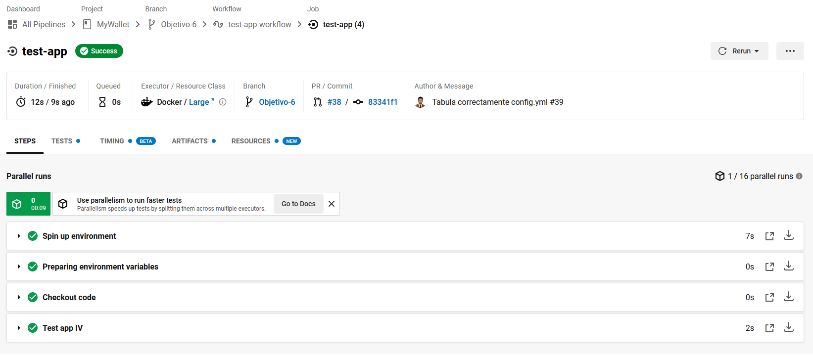
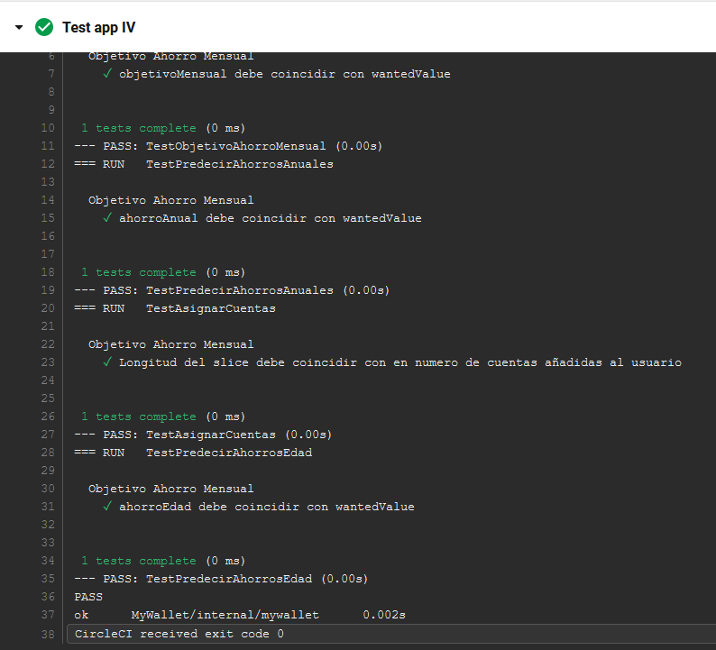

# Explicación de Circle CI
## Documentación
Para usar **Circle CI** como sistema de integración continua, se han consultado varias webs para poder entender las buenas prácticas con Circle CI.

* [Aquí](https://programmerclick.com/article/78021241003/) se tiene la documentación que nos ayuda a enteder la sintáxis usada para configurar el sistema.

## Utilidad
Circle CI, como sistema de integración continua, permite conectarte de forma muy sencilla con el repositorio de Github y actualizarlo por cada push. No presenta errores a la hora de descargar nuestra imagen de docker hub por tanto tiene completa compatibilidad con docker hub. Destacar que la documentación oficial nos comenta como trabajar con la versión 2. Existe una versión 2.1 pero he usado la version 2. Con la versión 2.1 existen nuevas directivas (las cuales nos podemos informar de ellas en el enlace del principio del documento) como 'when' y podemos evitar poner una versión en nuestro workflow, pero he optado por una opción más conservadora y basarme en la documentación oficial.

## Contrucción .circleci/config.yml
He montado el siguiente fichero de configuración:

```yaml
version: 2 # Es obligatorio indicar la versión que vamos a utilizar

jobs:
  test-app: # Indicamos un nombre a nuestro job
    docker: # especificamos la configuración del contenedor
      - image: luisarostegui/mywallet:latest # Aprovechamos la imagen de nuestro proyecto
    steps: 
      - checkout # Puede tener varios objetivos dependiendo de como se use.
      #  En nuestro caso, configura Git para omitir la recolección automática de basura.
      - run:
          name: "Test app IV" # Le asignamos un nombre a la acción que vamos a ejecutar
          command: "task test" # command sirve para especifiar una acción que se ejecute a traves del shell

workflows: # Orquesta el flujo de trabajo.
  version: 2 # Indicamos versión del workflow
  test-app-workflow:
    jobs:
      - test-app # Indicamos que se ejecute esta parte de jobs
```

Destacar los siguientes puntos:

* Se aprovecha la imagen que publicamos en docker hub gracias al trabajo realizado en el objetivo 5.
* En Circle CI tenemos que tener en cuenta varios conceptos:
    * Orbs, es un paquete de configuración compartido entre proyectos. Es similar a lo que nos encontramos en Github con las 'Actions'. Requiere la versión 2.1.
    * Jobs, son una serie de pasos, todos los pasos (steps) de los jobs son unidades independientes en el contenedor Circle CI.
    * Steps, es una colección de comandos ejecutables durante la ejecución del trabajo.

## Pruebas de funcionamiento

Una vez guardamos toda la configuración estos son los resultados obtenidos:



Podemos observar como se ejecutan los tests:

