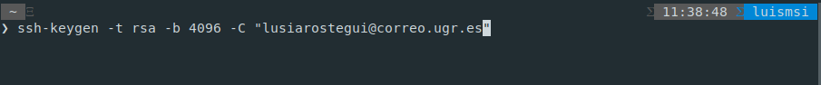
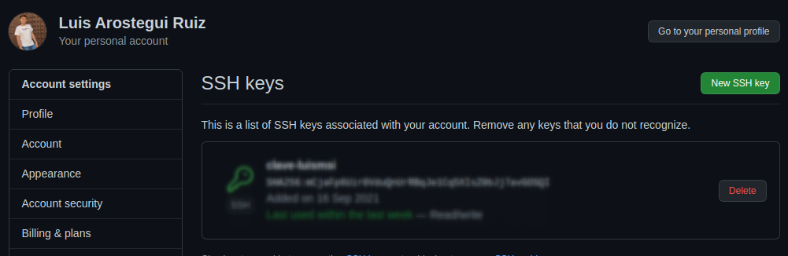

# Documentación hito 0

El hito 0 trata sobre la puesta en marcha de las herramientas necesarias para el desarrollo de un proyecto. Se usa Git y Github. Aparte de crear una cuenta en Github y realizar la configuración sugerida tenemos que realizar los siguientes pasos para proporcionar más seguridad en nuestro trabajo:

## Añadir una clave pública a GitHub

Hay que crear un par de claves pública/privada y añadir la privada al agente ssh y la pública a GitHub:




Añadimos al agente ssh la clave privada ejecutando:

```console
user@IV:~$ ssh-add ~/.ssh/id_rsa
```

Copiamos la clave pública

```console
user@IV:~$ clip < ~/.ssh/id_rsa.pub
```

Y la pegamos en GitHub:


